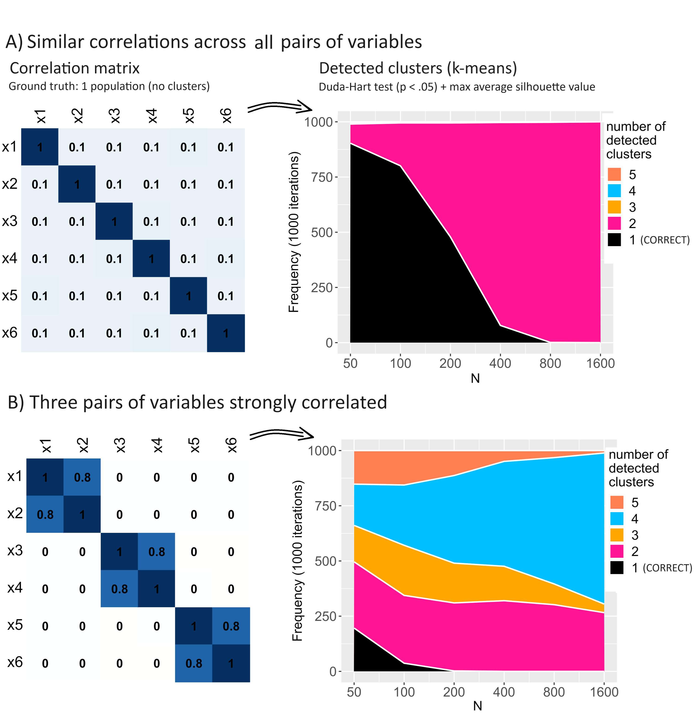
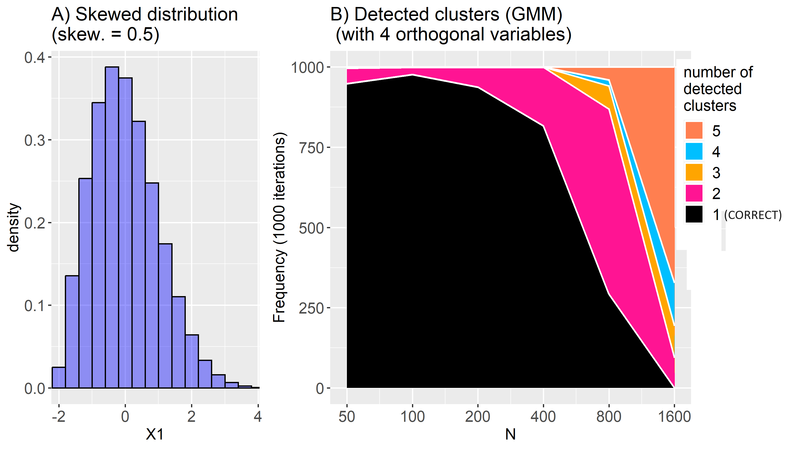
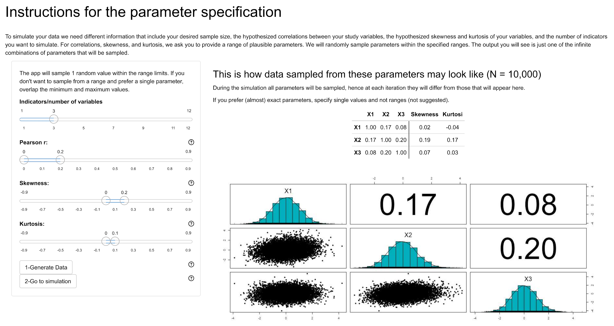
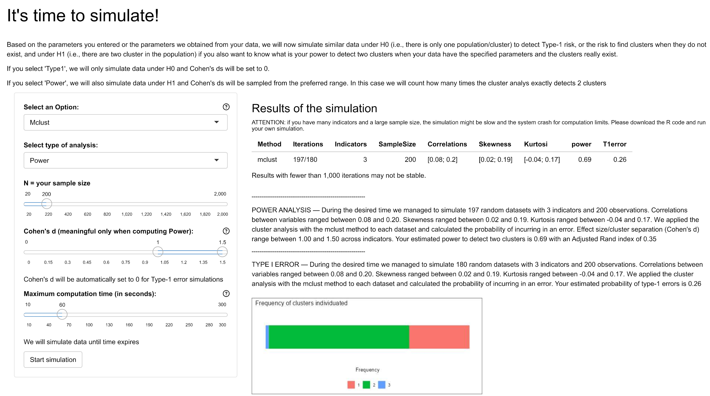

```{r setup, include=FALSE}
knitr::opts_chunk$set(
    fig.align = "center",
    comment = "#>",
    size = "footnotesize",
    dev = c("pdf", "tiff")
)
options(tinytex.verbose = TRUE)
```

```{r packages, include = FALSE}
library(papaja)
library(here)
library(knitr)
library(ggplot2)

# utils functions for the paper
source(here("paper", "utils-paper.R"), local = knitr::knit_global())

```

# Introduction

Clustering, or cluster analysis, is a family of unsupervised machine learning methods [@kassambara2017] that allow researchers to group sets of observations into smaller subsets (clusters) based on measures of similarity. In social science research, clustering is increasingly being used to "unveil" previously undetected subpopulations of individuals within larger samples. Ideally, clusters represent qualitatively different types of individuals whose discovery reveals hidden heterogeneity in the population. This discovery implies some inference, however, and in psychology this may be more problematic than generally believed, as we will show in the present paper.

Clustering is becoming increasingly popular in psychological and social science research. A search in Scopus (December 2023) using the following query on title, abstract, and keywords: ("latent profile analysis" OR "lpa" OR "latent class analysis" OR "lca" OR "cluster analysis" OR "clustering" OR "*k*-means"), with results limited to "psychology" and "social sciences" subject areas, showed that the volume of records published per year is now about 14-fold that of 2000. By comparison, the volume of all records published per year in the same subject areas is only just over 5-fold that of 2000 (the number of all records was approximated using the query "∗e∗"). Results are shown in Figure \@ref(fig:figure-literature-trends).

(Figure \@ref(fig:figure-literature-trends) here)

```{r figure-literature-trends, fig.cap="Publications per year (Scopus); see text for search queries and details.", fig.dpi=300, warning=F}
# require(ggplot2)
ts = 15
year = 2023:2000
clust = c(6011,5779,5132,4853,4381,3482,3001,2804,2479,2108,1881,
           1775,1600,1567,1332,1252,1102,902,637,623,574,443,402,417)
studies = c(503522,525003,508408,477728,459159,424020,405797,382256,
             356185,340015,343014,316020,288968,262260,244396,223088,
             197617,177979,158494,142882,135991,115732,102704,98561)
figtrend = data.frame(Year=rep(year,2),
    Publications=c(studies/studies[year==2000],clust/clust[year==2000]),
    Type=rep(c("All studies","Studies\n with\n clustering"),each=length(year)))
figtrend$Type = factor(figtrend$Type, levels=rev(c("All studies","Studies\n with\n clustering")))
ggplot(figtrend,aes(x=Year,y=Publications,group=Type,color=Type,linetype=Type,size=Type))+
  geom_line()+
  xlab("Year")+
  ylab("Ratio to year 2000")+
  scale_color_manual(values=c("red","blue"))+
  scale_linetype_manual(values=c(2,1))+
  scale_size_manual(values=c(1.5,1.5))+
  scale_y_continuous(breaks=seq(1,31,2))+
  theme(text=element_text(size=ts),
        title=element_text(size=ts*.75),
        axis.title.x=element_text(size=ts),
        axis.title.y=element_text(size=ts*.9),
        axis.text=element_text(size=ts),
        legend.title=element_text(size=ts*.75),
        legend.text=element_text(size=ts*.67),
        legend.key.size=unit(1.4,"cm"),
        legend.position = "bottom")+
  geom_hline(yintercept=1,linetype=3,size=1.8)
```

While clustering falls within the category of exploratory data analysis, we suggest that inferential risks should be considered whenever inference is made. In the case of clustering, inference can be made about the existence and the number of multiple subtypes within a larger population. In analogy with the traditional Neyman-Pearson approach to inference [@gigerenzer2004], we may formalize *type I* error (false-positive results) as detecting multiple clusters where they do not exist (or inflating the number of detected clusters), and *type II* error (false-negative results) as failing to detect multiple clusters where they truly exist.

Concerning *type II* error, lack of statistical power is a well-known problem in psychology [@szucs2017]. In cluster analysis, power may be mostly limited by effect sizes and availability of enough informative indicators. For example, @dalmaijer2023 suggests that adequate power could be reached even with small samples, but this requires measures on over 30 independent dimensions sharing informative contributions on cluster membership (i.e., all differing between clusters), with an average separation of 0.68 Standard Deviations (*SD*s; the value is about the average effect size in psychological research, uncorrected for publication bias, across 3,801 papers as computed by @szucs2017). Under more realistic research scenarios (i.e., sample sizes in the order of hundreds of cases, and availability of at most 6-12 independent indicators), @tein2013 and @toffalini2022 found that minimum effect sizes (between-cluster separation) should be of at least 0.80 *SD*s, but preferably above 1.00 *SD*, which are considered large effects in psychology.

*Type I* error has been widely investigated in relation to the replicability crisis [@lakens2023]. Illicit research practices such as *p*-hacking and uncorrected multiple testing in the context of confirmatory research are well-known. Inflation of *type I* error due to violations of assumptions in statistical methods is relatively less famous, but potentially more dangerous because it may lead to consistently replicable and yet false results. Minor violations of assumptions (and sometimes even major ones) do not necessarily impact *type I* error to a relevant extent, but this must be assessed case by case. A powerful tool to assess inferential risks is data simulation. Unlike real data, whose data-generating process is most frequently unknown in psychology, ground truth is always known when simulating data. This allows for establishing with certainty whether and how much a model misspecification or the violation of some assumptions leads to incorrect inference.

In this paper we present, via examples, a simple use of data simulation to perform sanity checks and establish *a priori* inferential risks when doing cluster analysis. We focused on two clustering methods: Gaussian mixture models (GMM) and *k*-means. We chose these two methods for their popularity and because they reflect different approaches and underlying assumptions. GMM is a model-based approach that fits data as mixtures of normal probability distributions. Among other advantages, it offers parameter estimates, models covariances within clusters, and clusters can present different sizes, densities, and shapes. It works, however, under the assumption of normally-distributed residuals (Gaussian distributions). In addition, GMM is based on an Expectation-Maximization (EM) algorithm which can fail to converge for high data dimensions, while the final clustering can depend on the initial values set in the EM algorithm for the parameters. On the contrary, *k*-means is a non-model-based, non-parametric procedure that does not require distributional assumptions. This method is based on a measure of distance to compare if two observations (i.e the Euclidean distance) and an aggregation rule. It starts selecting  a number of starting observations at random equal to the number of desired clusters and building around them the clusters. Like other non-model-based methods that group objects based on euclidean distances (but also like latent profile and latent class analysis, which are model-based), valid inference using k-means requires local (or "conditional") independence, meaning that no correlation across variables/indicators can be assumed within clusters. Also, valid use of *k*-means requires clusters of similar size and density. 

In the examples below we will focus on local independence and distributional assumption violations, just discussed in the previous paragraph. A deep discussion of these issues is beyond the scope of this paper, but we briefly note that both assumptions are especially problematic in psychological research. Consider research involving cognitive variables. A well-known phenomenon named positive manifold implies that any pair of variables involving any type of cognitive performance are always expected to correlate positively [@spearman1904; @van2006]. Positive manifolds have also been reported in very different fields of investigation, such as psychopathology [@caspi2014]. In brief, assuming true orthogonality (local independence) may be challenging. Dimensionality reduction via principal components may be a good alternative to using observed variables when performing clustering [@dalmaijer2023], although this might limit the interpretability of results. Concerning distributions, hardly any variable in psychology actually presents a truly Gaussian/Normal distribution [@micceri1989]. Sum scores of binomial (e.g., true/false, correct/incorrect) or ordinal (e.g., Likert scales) responses in tests or questionnaires are more the rule than the exception. Some degree of non-normality should always be expected in these cases. For example, *Mean* and *SD* are non-independent in a binomial distribution (e.g., a sum score of binomial responses), leading to some heteroscedasticity. In many applications of linear models, skewness below 1.00 is generally tolerated. Here, we emphasize that the violation of distributional assumptions may not always be a problem, but this must be assessed *a priori*. 

# Simulation

## Data analysis methods

All data analysis was performed with R [@R-base] Statistical software, version 4.3.2. We assume the reader being already familiar with base R. As explained in the Introduction, in our examples we employed model-based GMM and non-model-based *k*-means. GMM was fitted using the "mclust" package [@mclust], while *k*-means was performed using base functions. Plots were made using the "ggplot2" [@ggplot2package] and "corrplot" [@corrplotpackage] packages. Multivariate normally-distributed correlated data with skewness and kurtosis were simulated using the "semTools" [@semToolspackage] package (this package fails to adequately simulate large skewnesses, but it works well for coefficients below 1.00, which was more than enough for our purposes). We chose to focus on the following parameters of the data-generating process: sample size (*N*/number of observations), number of clustering indicators (*p*), correlations across indicators (Pearson's *r*), skewness, kurtosis, and standardized effect size (*d*, between-cluster separation in SDs). The latter is meaningful only when assessing power, as it implies the existence of true clusters with non-zero separation.

### *What do we mean by statistical inference here?*
GMM and *k*-means are clustering methods, but they do not perform statistical inference *per se*. The "true" number of clusters must be inferred via the identification of the optimal solution among alternatives. For GMM, we used the popular *Bayesian Information Criterion* (*BIC*) index. That is, GMM fits alternative models with varying number of clusters, and the one with the best *BIC* is retained as optimal (note that, unlike the typical use of *BIC*, the `mclust` package of R multiplies the *BIC* by -1, so higher *BIC* is better). For *k*-means, we adopted a two-step procedure: first, we tested the one-cluster solution with the Duda-Hart test [@duda1973; a formal statistical test to determine whether a dataset should be split into two clusters, @fpcpackage], using a significance level of *$\alpha$* = 0.05. Then, only if the one-cluster solution was rejected, the optimal solution was selected using the average silhouette method (mainly based on the calculation of the intra-vs-inter-cluster distance; higher values are better, as providing insights on a good aggregation). In all examples below, we tested solutions in the range of one-to-five clusters. Using other thresholds or indices (e.g., *AIC* index or entropy measures instead of *BIC*) may lead to different results, but the conditions under which inferential errors are inflated are generally the same. 

## Basic tutorial on data simulation for clustering

Before starting, let us load some R packages that will be needed. Users should make sure that they have already installed them, or in case use the "`install.packages("package-name")`" command.

```{r load-packages, echo=T}
library(mclust)
library(cluster)
library(semTools)
library(ggplot2)
library(fpc)
```

Clustering algorithms may be pretty complex. Luckily, just generating multivariate distributions with desired characteristics is pretty easy. In this tutorial, whenever random number generation occurs we ensure computational reproducibility by setting the `seed` using the `set.seed()` function. 

In the following chunk of R code, we create a custom data-simulating function named `generate_obs()`. Inside it, we use the function `mvrnonnorm()` from the `semTools` package to generate *N* observations on *p* variables/indicators, with a between-variable correlation equal to *corr*, with mean values equal to *mu*, and desired SD (*sd*), skewness (*skew*) and kurtosis (*kurt*).

```{r generate-obs, echo=T, cache=T}
generate_obs = function(N=NA, p=NA, corr=NA, mu=NA, sd=NA, skew=NA, kurt=NA){
    # define variance-covariance matrix
    Sigma = matrix(corr*sd^2, p, p) + diag(sd^2-corr*sd^2, p)
    # generate and return random sample of data
    df = mvrnonnorm(n=N, mu=rep(mu,p), Sigma=Sigma, skewness=skew, kurtosis=kurt)
    return(data.frame(df))
}
```

Now that this convenient function is created, we use it to generate 300 observations on four non-correlated variables/indicators distributed as standard Gaussians. The code ends showing the first few rows of the simulated sample.

```{r generate-obs-example, echo=T, cache=T}
set.seed(0)
# simulate sample and see first few rows
df = generate_obs(N=300, p=4, corr=0, mu=0, sd=1, skew=0, kurt=0)
head( round(df,3) )
```

Now, we perform GMM on this simulated sample using the `Mclust()` function. We test one- to five-cluster solutions. From the resulting object, we only extract "*G*", the number of clusters corresponding to the optimal solution. As expected, favored *G* = 1, suggesting that GMM has correctly identified the one-cluster solution as optimal (i.e., the mixture model with the optimal *BIC* features only one cluster). 

```{r perform-gmm-first-example, echo=T, cache=T}
# fit Gaussian mixture model (GMM) on data
fitGMM = Mclust(df, G=1:5)
```

Now that GMM is fitted, the optimal number of detected clusters can be accessed typing "`fitGMM$G`" in the R console, resulting in `r fitGMM$G` cluster.

Second, we perform *k*-means and identify the best solution using the Duda-Hart test and the maximum average silhouette value. This is slightly more complex, as it is not wrapped in an existing function, so we have to define a custom one. Luckily, also *k*-means identifies the one-cluster solution as optimal. 

```{r perform-kmeans-first-example, echo=T, cache=T}
# define function for detecting optimal clustering solution 
# using k-means in a given range ("krange")
kmeans_opt = function(data=NA, krange=1:5, alpha=0.05){
    # first perform duda-hart test on two-cluster solution
    km2 = kmeans(data, centers=2)
    dh = dudahart2(data, clustering=km2$cluster, alpha=alpha)
    if(dh$cluster1 & 1%in%krange == TRUE){
        return(1)
    }else{ # test more clusters only if duda-hart test is significant
    sil = rep(-1,max(krange))
    for(i in krange[krange!=1]){
        km = kmeans(data, centers=i)
        # compute silhouette value for i-cluster solution
        silvalue = silhouette(km$cluster, 
                              dist=dist(data, 
                                        method="euclidean"))[,"sil_width"]
        sil[i] = round(mean(silvalue), 8)
    }
    # best solution has maximum silhouette value
    return(which(sil==max(sil)))
    }
}
```

Now that the function is written, the optimal number of detected clusters can be accessed typing "`kmeans_opt(data=df)`", which yields "`r kmeans_opt(data=df)`" as output.

Lastly, if one seeks a faster solution using a partitioning, distance-based algorithm like *k*-means, but with the selection of the optimal solution wrapped in a single existing function, the "Partitioning Around Medoids" (PAM) clustering method may be a preferred alternative. The `pamk()` function is implemented in the `fpc` package. 

```{r perform-pamk-first-example, echo=T, cache=T}
fitPamk = pamk(data=df, krange=1:5, alpha=0.05)
```

The number of detected clusters (optimal solution) can be simply accessed by typing "`fitPamk$nc`", which yields "`r fitPamk$nc`" as output.

To test whether the above methods adequately detect multiple clusters when they exist, we simulate a three-cluster sample. Pairs of clusters are separated by *d* = 5.00 on each variable, except the first and third cluster, that are separated by *d* = 10.00. (Note that such effect sizes should not be routinely expected in psychological research.)

```{r generate-three-cluster-samples, echo=T, cache=T}
set.seed(0)
# simulate three-cluster sample
d = 5.00 # set effect size (cluster separation)
clust1 = generate_obs(N=100, p=4, corr=0, mu=0,   sd=1, skew=0, kurt=0)
clust2 = generate_obs(N=100, p=4, corr=0, mu=d,   sd=1, skew=0, kurt=0)
clust3 = generate_obs(N=100, p=4, corr=0, mu=d+d, sd=1, skew=0, kurt=0)
df = rbind(clust1, clust2, clust3) # combine data of the 3 clusters
```

Now that the data for the three clusters are generated, let us visualize the bivariate scatter plot on the first two indicators ("X1" and "X2") using the "`plot(df[,c("X1","X2")])`" command. Figure \@ref(fig:figure-three-cluster-example) below displays the result, clearly showing three distinct clusters.

(Figure \@ref(fig:figure-three-cluster-example) here)

```{r figure-three-cluster-example, fig.cap="Example of scatter plot showing three clusters with very large separations.", echo=F, cache=T, fig.dpi=300, warning=F, results="hide", out.width="50%", fig.width=5, fig.height=5}
plot(df[,c("X1","X2")], cex=1.5, cex.axis=1.5, cex.lab=1.5)
```

Unsurprisingly, in this case both GMM and *k*-means lead to identifying the three-cluster solution as optimal. Typing "`Mclust(data=df, G=1:5)$G`" for GMM yields `r Mclust(data=df, G=1:5)$G` as output, and so does typing `kmeans_opt(data=df)` for *k*-means: `r kmeans_opt(data=df)`.

## Analysis of *type I* error and Power

The above simplified examples were run under ideal conditions for illustrative purposes. In the rest of the paper, we will focus mostly on inferential issues, and especially *type I* error. Special attention will be given to conditions that are typical in psychological research. 

In the following example we assess how even modest skewness may inflate the number of detected clusters when using GMM or *k*-means. We simulate a one-cluster population with sample *N* = 700, measured with 4 indicators that are uncorrelated but show some skewness (*skew* = 0.50). To systematically assess inferential risks, many iterations must be run: here we run 100 ("`niter`" variable in R code below; note that many more iterations are generally required to get stable results: at least 1,000 is recommended; here, for purely illustrative purposes, we run few iterations to speed up computational times in case the user wants to try the code). If a clustering method is robust to skewness, it should consistently select the one-cluster solution as optimal, leading to a *type I* error rate close to zero.

```{r example-with-some-skewness, echo=T, cache=T, results="hide"}
set.seed(0)
niter = 100
# pre-allocate vectors of results for efficiency
detectedClusters_GMM = rep(NA, niter)
detectedClusters_kmeans = rep(NA, niter)
# run type I error simulation: perform GMM and k-means on 100 simulated datasets
for(i in 1:niter){
    # generate data with skewness
    df = generate_obs(N=700, p=4, corr=0, mu=0, sd=1, skew=0.50, kurt=0)
    # store results
    detectedClusters_GMM[i] = Mclust(df, G=1:5)$G
    detectedClusters_kmeans[i] = kmeans_opt(df, alpha=0.05)
}
```

Once the above chunk is run, we estimate the type I error risk — that is, percentage of times GMM and *k*-means did NOT favor the correct one-cluster solution — by typing the following commands. For GMM: "`100*mean(detectedClusters_GMM!=1, na.rm=T)`", which results in `r 100*mean(detectedClusters_GMM!=1, na.rm=T)`% *type I* error rate. For *k*-means: "`100*mean(detectedClusters_kmeans!=1, na.rm=T)`", which results in `r  100*mean(detectedClusters_kmeans!=1, na.rm=T)`% *type I* error rate. Therefore, results show that using GMM on moderately skewed data grossly inflates the number of clusters detected as optimal solution (48% of iterations end up in detection of multiple clusters that do not exist in the data-generating process), while virtually no risk emerges when using *k*-means (in all but one iteration the one-cluster solution is correctly detected as optimal).

In the following example we do the same as above, but now instead of manipulating skewness, which we bring back to zero, we set moderate correlations across indicators (*r* = 0.35). The rest is the same.

```{r example-with-some-correlation, echo=T, cache=T, results="hide"}
set.seed(0)
niter = 100
# initialize vectors of results
detectedClusters_GMM = rep(NA, niter)
detectedClusters_kmeans = rep(NA, niter)
# run type I error simulation: perform GMM and k-means on 100 simulated datasets
for(i in 1:niter){
    # generate correlated data
    df = generate_obs(N=700, p=4, corr=0.35, mu=0, sd=1, skew=0, kurt=0)
    # store results
    detectedClusters_GMM[i] = Mclust(df, G=1:5)$G
    detectedClusters_kmeans[i] = kmeans_opt(df, alpha=0.05)
}
```

Once again, we get the estimated type I error rates as follows: for GMM we type "`100*mean(detectedClusters_GMM!=1, na.rm=T)`", which results in `r 100*mean(detectedClusters_GMM!=1, na.rm=T)`%. For *k*-means we type "`100*mean(detectedClusters_kmeans!=1, na.rm=T)`", which results in `r 100*mean(detectedClusters_kmeans!=1, na.rm=T)`%. Therefore, now GMM leads to a very small risk of false-positive results, whereas the risk is extremely high when using *k*-means (in all 100 iterations, the two-cluster solution is incorrectly favored), and this is due to violating the local independence assumption (note that `corr=0.35`). 

Finally, we show an example of power analysis. We simulate a sample of *N* = 700 presenting two real clusters (of *n* = 250 and *n* = 450) with a separation (effect size) of *d* = 0.50 in all 4 orthogonal and normally-distributed indicators. In this case there are no violations of assumptions. The effect size is perfectly plausible in applied psychology, although expecting to find it simultaneously in all 4 non-correlated variables of interest may look bordering on credibility in psychological research, especially in the context of exploratory data analysis.

```{r example-power-under-no-violations, echo=T, cache=T, results="hide"}
set.seed(0)
niter = 100
d = 0.50 # set effect size
detectedClusters_GMM = rep(NA, niter)
detectedClusters_kmeans = rep(NA, niter)
# run power simulation: perform GMM and k-means on 100 simulated datasets
for(i in 1:niter){
    # generate data in 2 clusters
    clust1 = generate_obs(N=250, p=4, corr=0, mu=0, sd=1, skew=0, kurt=0)
    clust2 = generate_obs(N=450, p=4, corr=0, mu=d, sd=1, skew=0, kurt=0)
    df = rbind(clust1, clust2)
    # store results
    detectedClusters_GMM[i] = Mclust(df, G=1:5)$G
    detectedClusters_kmeans[i] = kmeans_opt(df, alpha=0.05)
}
```

To get the Power estimate (1 - *type II* error rate), we calculate the percentage of times the two-cluster solution was correctly favored. For GMM, we type "`100*mean(detectedClusters_GMM==2, na.rm=T)`", which results in an estimated `r 100*mean(detectedClusters_GMM==2, na.rm=T)`% power. For *k*-means, we type "`100*mean(detectedClusters_kmeans==2, na.rm=T)`", which results in an estimated `r 100*mean(detectedClusters_kmeans==2, na.rm=T)`% power. Therefore, under the above somehow ideal conditions, statistical power is absolutely insufficient using either clustering method, with *N* = 700. 

When performing a power analysis, a useful complementary piece of information is the correct classification performance. The Rand Index [@rand1971] can be used for this purpose. This is important because under some scenarios the clustering method might apparently identify the number of clusters correctly, but this is accidental or due to violation of assumptions, which leads to incorrect classification. Below we show an example: *k*-means is used, two real clusters exist with the same separation as above (*d* = 0.50), but the locality assumption is violated (data are correlated, *r* = 0.35). We used an adjusted version of the Rand Index as implemented in the "mclust" package of R [unlike @toffalini2022, who used the unadjusted index]: its interpretive advantage is that it goes around 0 when classification is at chance level.

```{r example-rand-index, echo=T, cache=T, results="hide"}
set.seed(0)
niter = 100
d = 0.50 # set effect size
# initialize vectors of results
detectedClusters_kmeans = rep(NA, niter)
randIndex_kmeans = rep(NA, niter)
# power analysis: perform k-means, run 100 times
for(i in 1:niter){
    # generate real clusters but with correlated data
    clust1 = generate_obs(N=250, p=4, corr=0.35, mu=0, sd=1, skew=0, kurt=0)
    clust2 = generate_obs(N=450, p=4, corr=0.35, mu=d, sd=1, skew=0, kurt=0)
    df = rbind(clust1, clust2)
    # "real" classification vector
    realCluster = c(rep("clust1",nrow(clust1)),rep("clust2",nrow(clust2)))
    # store results
    kopt = kmeans_opt(df, alpha=0.05)
    detectedClusters_kmeans[i] = kopt
    # k-means-predicted classification vector
    predictedCluster = kmeans(df, centers=kopt)$cluster
    # rand index compares real vs predicted classification vectors
    randIndex_kmeans[i] = adjustedRandIndex(realCluster, predictedCluster)
}
```

Now we type "`round( mean(randIndex_kmeans, na.rm=T), 2)`" to get the *mean adjusted Rand Index* (rounded to the 2^nd^ decimal value), which yields `r round(mean(randIndex_kmeans, na.rm=T), 2)`.  Such an extremely poor classification accuracy seems at odds with the high power achieved, which we estimate typing "`100*mean(detectedClusters_kmeans==2, na.rm=TRUE)`" and yields `r 100*mean(detectedClusters_kmeans==2, na.rm=TRUE)`% power. Therefore, the above simulating conditions present a very high chance of detecting two clusters, but not of correctly classifying them. Indeed, as shown above, the algorithm would detect two clusters even if they were not there (high *type I* error rate) due to the violation of the local independence assumption (*r* = 0.35). Thus, just estimating power without simultaneously considering *type I* error rate and classification accuracy is risky and inappropriate. In the above case, better classification accuracy is achieved with larger effect sizes: with *d* = 2.00 (which is implausible in most psychological research, however) we get *mean adjusted Rand Index* = 0.68.

# Examples on more complex scenarios

In this section we present a few additional examples on more complex scenarios. They represent extensions of the procedures explained above, although they are not accompanied by detailed in-text R code. Full R code can be found on GitHub: [https://github.com/psicostat/clustersimulation](https://github.com/psicostat/clustersimulation){target="_blank"}

## Specific patterns of correlations lead to specific cluster solutions being favored when using *k*-means

As shown above, if local independence is violated optimal solutions may present an inflated number of clusters when using *k*-means. If the index used for decision is the Silhouette value, the two-cluster solution will most frequently be preferred. This means that the Duda-Hart test incurs *type I* error due to the violation of local independence, but luckily the Silhouette value is parsimonious enough to limit further inflation. 

Nevertheless, specific patterns of correlations may lead to particular cluster solutions being detected as optimal. Figure \@ref(fig:figure-matrix-correlation) shows two examples: in panel A) correlations are distributed homogeneously across all pairs of variables (a typical positive manifold with modest correlations), and the two-cluster solution is predominantly favored; contrarily, in panel B) there are three strong pairs of correlation, possibly indicative of three factors each affecting a couple of variables: in this latter case, three-, four-, and even five-cluster solutions are more frequently favored, with the four-cluster solution becoming predominant as sample size (*N*) increases.

(Figure \@ref(fig:figure-matrix-correlation) here)

```{r figure-matrix-correlation, fig.cap="Example of patterns of correlations leading to multiple clusters being detected using k-means (no real clusters are there).", echo=F, cache=T, out.width="100%"}


```

## Modest skewness may become critical with large samples when using Gaussian mixture models 

Researchers are aware that normal distributions are unlikely to occur in psychology [@micceri1989]. Nevertheless, violation of distributional assumption is not necessarily a major evil when fitting statistical models. For example, in linear regression violation of the normality assumption has been shown to impact false-positive results to a limited degree, and much less than the violation of other assumptions such as independence of residuals [e.g., @knief2021]. This is not the case, however, for GMM. While in other contexts skewnesses of up to 1.00 are tolerated as a rule of thumb, even much smaller skewnesses become critical when performing GMM [@vanhorn2012]. In the Figure \@ref(fig:figure-modest-skewness) below, we show how a modest degree of non-normality (skewness = 0.5) consistently leads to multiple-cluster solutions being incorrectly favored when using GMM. As for other violations of assumptions, the problem becomes especially evident with large samples: with *N* around or above 1,000 it is virtually guaranteed that GMM will (largely) inflate the number of detected clusters. The simulation was performed with *p* = 4 variables/indicators. 

(Figure \@ref(fig:figure-modest-skewness) here)

```{r figure-modest-skewness, fig.cap="Example of modest skewness leading to multiple clusters being detected using Gaussian mixture models when samples are large (with 4 orthogonal variables), no real clusters are there.", echo=F, cache=T, out.width="100%"}



```

# Assumptions should really be made *a priori*

In this paper we have been focusing on two assumptions: local independence and distributional assumptions. Generally, researchers are aware that assumptions must not be checked directly on observed data (marginal distributions). Consider local independence when performing *k*-means. If this assumption is met but one cluster presents higher mean values than another in two variables simultaneously, these two variables will appear positively correlated. Similarly, consider the normality assumption in GMM. If two clusters have perfectly Gaussian distributions on a variable but they have different mean values, the combined distribution will not be Gaussian (if the separation between mean values is larger than 2 *SDs*, the mixture distribution may even appear bimodal).

A common misunderstanding is that the above assumptions can be checked with ease *after* clustering is done. When doing clustering, however, an exploratory approach is adopted. Generally, this means that several alternative clustering solutions are tested and the best one is retained [cf. @toffalini2022, for a review of recent papers performing clustering in psychological research]. Critically, the best solution will fit the data in the best possible way, and it may tend to minimize violations. Below we offer two examples.

Consider a case in which two variables are measured in a sample of 700 cases. The variables correlate *r* = 0.50 on a continuum, with no clusters at all. As shown above, this violates the local independence assumption and may lead to incorrect conclusions when using *k*-means. Indeed, in the simulated case shown below in Figure \@ref(fig:figure-kmeans-assumptions), a two-cluster solution is incorrectly identified as the best one. If one looks at the correlation within each cluster, however, that is virtually zero (*r* = 0.00 and *r* = -0.02 respectively), but this is clearly no evidence of local independence.

(Figure \@ref(fig:figure-kmeans-assumptions) here)

```{r figure-kmeans-assumptions, fig.cap="K-means: example of correlated data (no real clusters are there) that are no longer correlated after centering on detected clusters.", echo=F, cache=T, fig.dpi=300, warning=F, results="hide", out.width="70%"}
set.seed(0)
# generate dataset with 2 moderately correlated indicator, see actual correlation
df = generate_obs(N=700, p=2, mu=0, sd=1, cor=0.5, skew=0, kurt=0)
(cr_observed = cor.test(df$X1, df$X2))
# perform k-means, choose the optimal solution, extract clusters
km = kmeans(df,centers=kmeans_opt(df))
df$cluster = as.factor(km$cluster)
# plot results
ggplot(df,aes(x=X1,y=X2,color=cluster,shape=cluster))+
    geom_point(size=2.5,alpha=0.7)+
    theme(text=element_text(size=20))
# mean center observations
df$X1centered = NA
df$X2centered = NA
for(k in 1:nrow(km$centers)){
    df$X1centered[df$cluster==k] = df$X1[df$cluster==k] - km$centers[k,"X1"]
    df$X2centered[df$cluster==k] = df$X2[df$cluster==k] - km$centers[k,"X2"]
    print(cor.test(df$X1centered[df$cluster==k], df$X2centered[df$cluster==k]))
}
(cr = cor.test(df$X1centered,df$X2centered))
```

When using GMM, checking the distributional assumption after clustering is done may be somehow less problematic than the case above. Consider the example shown below in Figure \@ref(fig:figure-gmm-assumptions). Two uncorrelated variables are measured. No real clusters are there. X2 is normally distributed, but X1 presents *skewness* = 1.00 (which is large). Due to skewness, GMM incorrectly favors a 5-cluster solution (in a one-to-five range). X1 skewness is very modest in three of the emerging clusters: 0.04, 0.17, and 0.21, but it is still large in other two, *skewness* = 0.76 and 0.81. Running more iterations like this suggests that clusters identified via GMM often present less skewness than the original distribution, but normality of residuals is hardly ever achieved. 

(Figure \@ref(fig:figure-gmm-assumptions) here)

```{r figure-gmm-assumptions, fig.cap="Gaussian mixture model: example of skewed data (no real clusters are there) that are less skewed within detected clusters.", cache=T, fig.dpi=300, warning=F, results="hide", out.width="70%"}
set.seed(0)
# generate dataset with 2 moderately correlated indicator, see actual correlation
df = data.frame(mvrnonnorm(n=700,mu=c(0,0),Sigma=diag(2),skewness=c(1.8, 0),kurtosis=0))
(sk_observed = moments::skewness(df$X1))
# perform k-means, choose the optimal solution, extract clusters
gmmfit = mclust::Mclust(df,G=1:5)
df$cluster = as.factor(gmmfit$classification)
# plot results
ggplot(df,aes(x=X1,y=X2,color=cluster,shape=cluster))+
    geom_point(size=2.5,alpha=0.7,stroke=1.5)+
    theme(text=element_text(size=20))
# mean center observations
df$X1centered = NA
df$X2centered = NA
for(k in 1:length(levels(df$cluster))){
    print(moments::skewness(df$X1[df$cluster==k]))
}

```

To conclude, assumptions should really be made *a priori*. Local independence implies that we must have good reasons to consider the variables as truly orthogonal (*r* $\approx$ 0) within a cluster/in a homogeneous population *before* deciding to perform clustering. Normality assumption implies that we can truly consider distributions as Gaussian for all variables (non-normality is thus necessarily assumed to reflect a mixture of underlying clusters).

# Shiny app

To help readers perform their own computations, we created a graphical interface via the "shiny" package of R [@shinypackage]. The code is fully available on GitHub ([https://github.com/psicostat/clustersimulation](https://github.com/psicostat/clustersimulation){target="_blank"}), while the web app is deployed at [https://psicostat.shinyapps.io/clustersimulation-demo/](https://psicostat.shinyapps.io/clustersimulation-demo/){target="_blank"} (in case of problems with the link, see the "[README](https://github.com/psicostat/clustersimulation#readme){target="_blank"}" document on GitHub for alternatives). 

The shiny app allows the user to compute *type I* error and power analysis under research scenarios characterized by desired sample size (*N*), number of variables/indicators, their correlations, skewness, and kurtosis, and cluster separations (Cohen's *d* on each variable, only if power is computed). For simplicity, only the "H1" hypothesis that there are 2 real clusters is currently implemented for Power analysis in the shiny app. 

The app comes with two main possibilities: to specify the data-generating parameters based on your knowledge/expectations ("Data Specification"), or using an already existing dataset that you can upload ("Data Upload"). The only exception is Cohen's *d*, which must always be specified based on prior expectations (like any effect size in a power analysis). When choosing "Data Specification" the user is required to specify the number of indicators/variables and their correlations, skewness, and kurtosis. The latter three parameters are randomly sampled from uniform ranges (unless the bounds of the ranges are constrained to equality) based on the user's specifications. Ranges allow the user to introduce some variability in the parameters. An example is shown in Figure \@ref(fig:figure-data-specification-shiny). Subsequently, the users can run "Generate Data" to sample a particular set of parameters. Alternatively, when choosing "Data Upload", the parameters will be directly determined based on an uploaded dataset (only quantitative variables are permitted). 

The app is based on a sets of functions that can be used also within R scripts (outside the graphical interface) to implement more complex and extensive simulation.

(Figure \@ref(fig:figure-data-specification-shiny) here)

```{r figure-data-specification-shiny, fig.cap="Example of the 'Data specification' tab with some random parameters in the shiny app (version 1.0).", echo=F, cache=T, out.width="100%"}



```

After the previous phase is completed the user must go to simulation, where they will effectively run a Monte Carlo simulation for computing *Type I* error and/or Power analysis. Consistently with what is shown in the paper, only GMM (Mclust) and *k*-means are now implemented in the shiny app (version 1.0). Two additional parameters that must be set here are: sample size (*N*) and cluster separation/Cohen's *d* (meaningful only when computing Power). Before running "Start simulation", maximum computation time must be set (default is 10 seconds). We preferred to set a computation time limit rather than a predetermined number of iterations because time is obviously the main constraint in the user experience of a web app. After simulation is done, a short text summarizing the simulation parameters and the results is offered as output, along with a plot showing the distribution of number of clusters favored as best solutions. An example is shown in Figure \@ref(fig:figure-simulation-shiny).

(Figure \@ref(fig:figure-simulation-shiny) here)

```{r figure-simulation-shiny, fig.cap="Example of the 'Simulation' tab with results in the shiny app (version 1.0).", echo=F, cache=T, out.width="100%"}



```

# Conclusions

Despite clustering involves an exploratory approach to data analysis, we insist that inferential risks must be evaluated *a priori* if the goal is statistical inference. This is frequently the case in both applied and basic research, where researchers aim to detect and describe allegedly distinct types of individuals based on psychological dimensions [see the literature review by @toffalini2022]. In the present article, we have offered an R tutorial and a shiny app to help researchers assess *type I* error rates and run power analysis when performing clustering on their quantitative data. The shiny app was created for illustrative purposes to implement a few representative cases, while the R tutorial is aimed to provide the reader with the conceptual and practical tools for building up and exploring arbitrarily complex scenarios. Via examples, we showed that violations of assumptions to a degree that is often neglected in psychological research (e.g., correlations of *r* = 0.10 when performing *k*-means in panel A of Figure \@ref(fig:figure-matrix-correlation), or skewness = 0.50 when performing GMM in Figure \@ref(fig:figure-modest-skewness)) may powerfully lead to identify clusters that are not there.

We conclude with a few additional considerations. First, it is possible that, under some scenarios, multiple clusters are incorrectly detected even if no assumptions are violated. For example, GMM should ideally model covariances across indicators. However, @toffalini2022 showed that this method may incorrectly favor multiple-cluster solutions when there is a weak positive manifold across variables and the sample size is not sufficiently large to model it. Second, here we showed the consequence of non-normality of data distribution by manipulating skewness, but large kurtosis is equally problematic for GMM (the reader can try that using the shiny app). Finally, we focused only on local independence and distributional assumptions, but violations of other assumptions might be equally problematic. For example, non-independence of observations due to known groupings that are not the goal of a cluster analysis (e.g., children in schools), or differences in size, density, or sphericity of clusters in *k*-means. Finally, we chose to omit considering other clustering methods such as density-based ones (e.g., DBSCAN). This is because they imply between-cluster separations so large such as they leave near-zero density areas in the middle, which requires separations that are implausible in psychological research. 
Also, other methods are based on testing the unimodality of the (multivariate) distribution without making distributional assumptions [e.g., @fischer1994]. In the present paper we chose the simplest approach and we only drew attention to making inference in exploratory procedures. After understanding the logic of this R tutorial, however, the interested reader will be able to scale up their own simulations on any customized scenario. 

## Code availability

The Rmarkdown of the present paper and all code for reproducibility of results is available on GitHub at [https://github.com/psicostat/clustersimulation](https://github.com/psicostat/clustersimulation){target="_blank"} 

\newpage

# References

::: {#refs custom-style="Bibliography"}
:::


